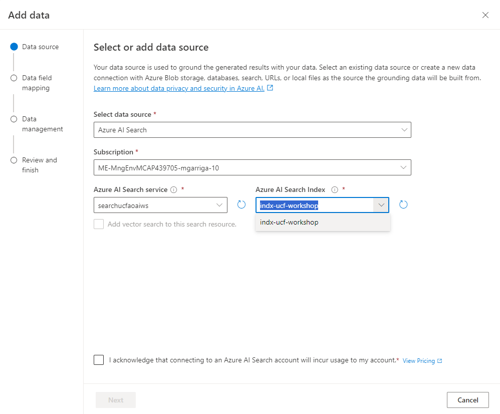
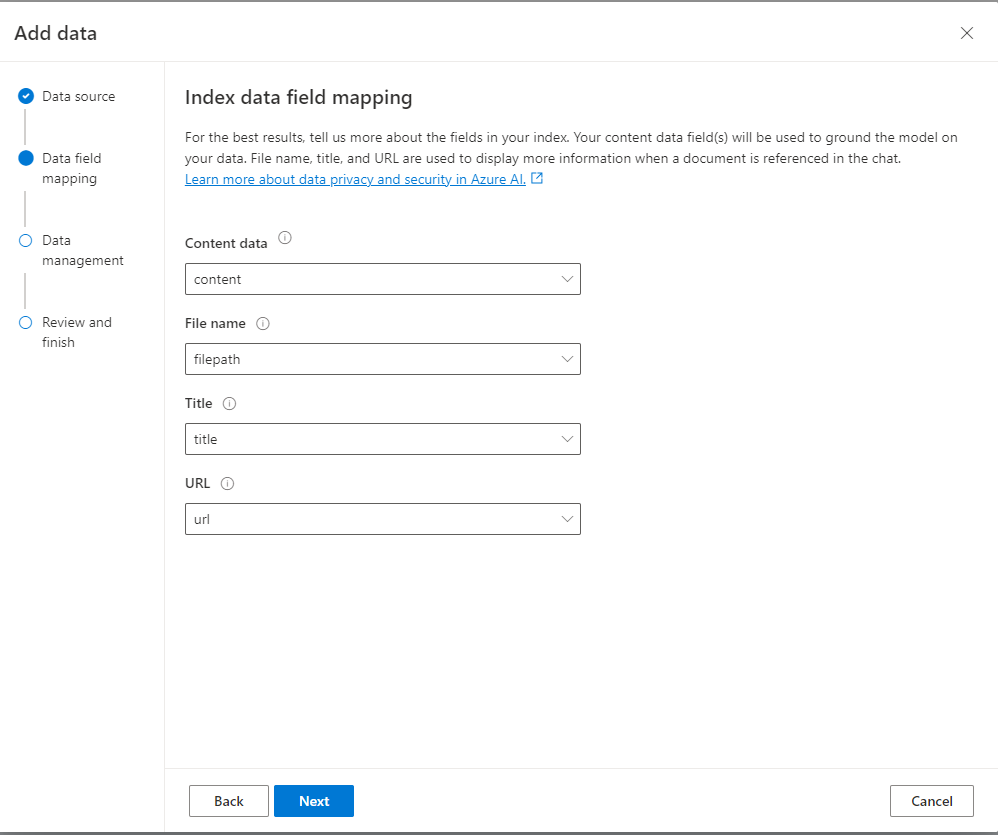
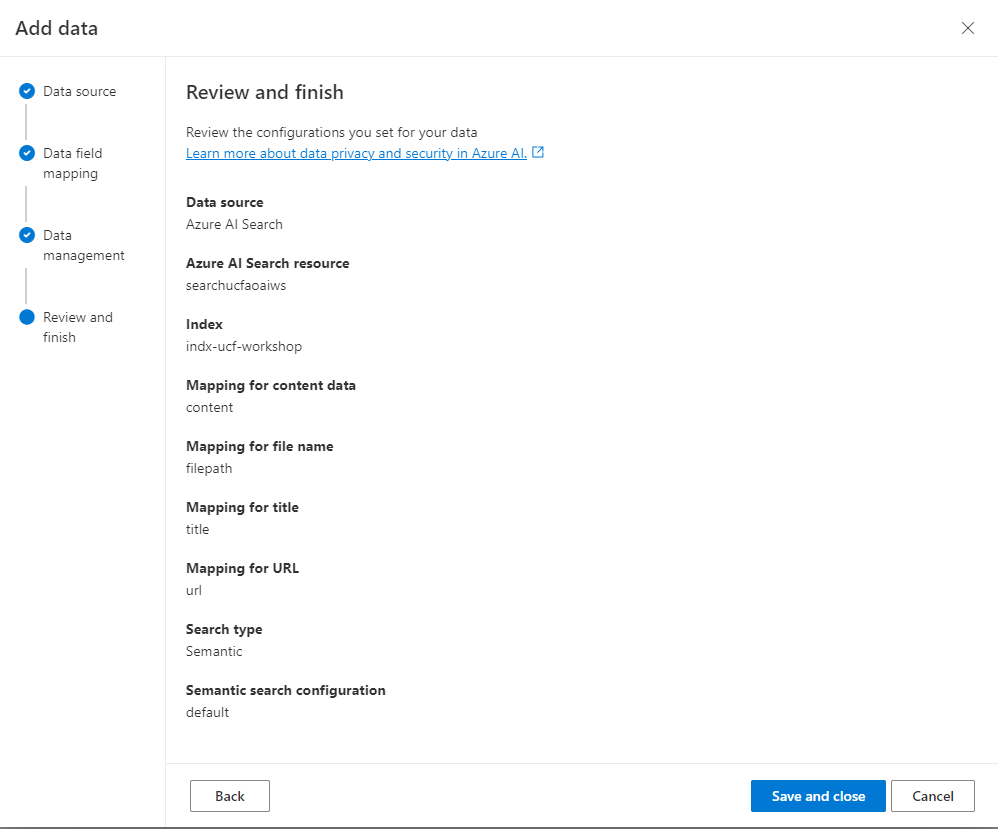

# Azure OpenAI On Your Data Workshop

In this workshop, you will learn how to use Azure OpenAI On Your Data to chat with the NIH’s 321 page PDF for preparing and submitting grant applications to Grants.gov. You will be able to ask questions and get answers from the guidelines using natural language, as well as analyze and summarize the content using powerful language models such as GPT-35-Turbo and GPT-4.


- [Azure OpenAI On Your Data Workshop](#azure-openai-on-your-data-workshop)
  - [Set the System Message](#set-the-system-message)
  - [Add your data](#add-your-data)
  - [Deploy to Web App](#deploy-to-web-app)


## Set the System Message

A system message is a type of prompt that can be used to guide the behavior and performance of a chat model in Azure OpenAI On Your Data. A system message can define the model’s profile, capabilities, limitations, output format, examples, and guardrails for a specific scenario. A system message can help increase the accuracy and grounding of the model’s responses based on the user’s data.

1. Copy the following system prompt into your clipboard:
```
Your name is GrantGPT, a friendly and helpful grant-writing assistant tasked with helping a principal investigator (PI) write grant research grant proposals, receive feedback on their proposals, and answer questions on the NIH's grant writing guidelines. You have been grounded on the NIH's grant writing guidelines and that is the only source of data you are allowed to use to answer questions. If there isn't enough information, say you do not know. If asking clarifying questions to the user would help, ask the question.
```
1. From the *Azure AI Studio* click **Chat** from the left-hand navigation pane and paste the contents of your clipboard into the **System message** text box. Next, click **Save changes.**

    

1. After your System Message has been saved, test the chatbot by asking it how it can help you.

    

## Add your data
1. From the *Chat* section of *Azure AI Studio* click **Add your data** followed by **+ Add a data source**.

    

2. Select **Azure AI Search** for **Select data Source**. Set **Subscription** to your Azure OpenAI subscription, select **Azure AI Search Service** to the `searchucfaoaiws`, and select **Azure AI Search Index** to `indx-ucf-workshop` and **check the box to acknowledge** at the bottom of the screen and click **next**.

    

3. On the next page, keep everything default and click **Next**.

    

4. Chose *Semantic* for **Search Type**, and keep semantic search configuration as **default**. Check the box that warns against usage charges and click **Next**.

    

5. Finally, click **Save and Close.**

    

Your data will take a few minutes to processed into "*chunks*." This is done because Azure OpenAI models can only process a limited amount of text at a time. To use them on large data sources, you need to split your data into smaller chunks. Azure Cognitive Search uses a custom skill that leverages the Azure OpenAI chunking API to first chunk the data in the storage account and then index the the chunks.


Once the system is done processing the data, you can interact with the chat session to test it.


## Deploy to Web App

Now that that we've confirmed that GPT is grounded on your data, we can deploy this as a dedicated web app.

1. Click on the **Deploy To** button on the top-right of the screen and select *A new web app...*

    

1. Select *Create a new web app*, provide it with a globally-unique **Name**. Choose your OpenAI **Subscription** and the *AOAI-OnYourData-RG* for the **Resource Group**. Next, select your preferred **Region** and *S1* for the **Pricing Plan**. Finally, click **Enable Chat History** and acknowledge that both Chat History and the Web App will incur charges. Finally, click **Deploy**.

    


The deployment will take a few minutes to complete. After it is done, there'll be an additional wait of approximiately 10 minutes for Entra ID to secure the web app. Once it is complete, you'll be able to click the **Launch Web App** icon on the top right of the screen to take you to your new chat bot.


---

**Warning:** The resources deployed in this lab are not free and will incur charges if you do not delete them after completing the lab. To avoid unwanted charges, please follow the instructions in the [cleanup section](cleanup.md) to delete the resources when you are done.

---
